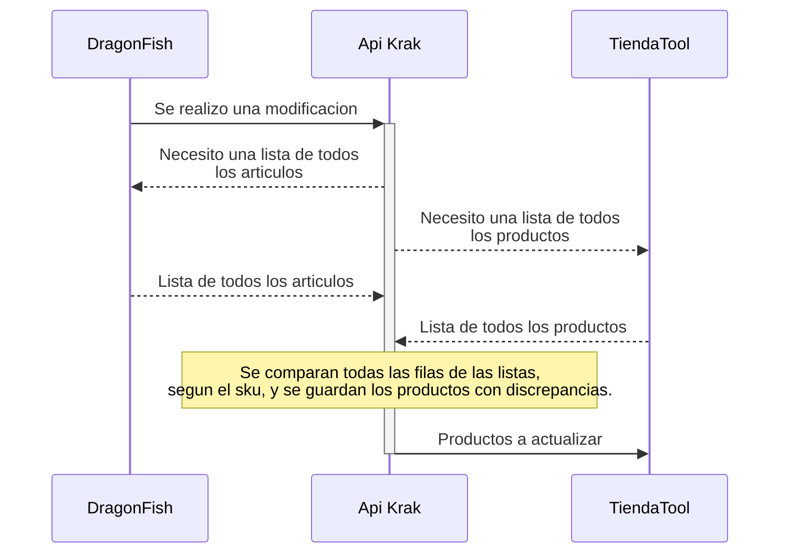
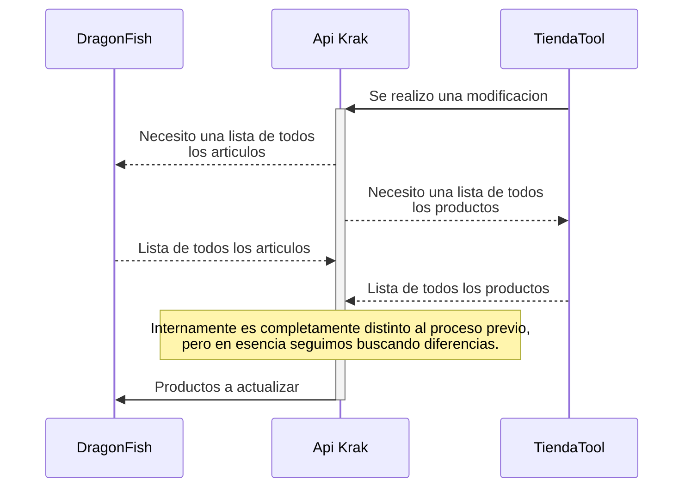


# Integracion DragonFish/WooCommerce

  

En este documento se detalla el flujo de datos de la actual integracion de DragonFish y WooCommerce.

  

Sobra aclarar:

  

| Opcion | Costo | Tiempo |
| :------------------------------------------ | :---------: | :---------: |
| Integracion Propietaria   de DragonFish | `$ 237 000` | `1 dia` |
| Integracion Krak | `$ 0` | `2 semanas` |

  

## Diagrama de flujo

  

### En caso de un cambio en DragonFish 
> Ejemplo: Se cargo stock, aumento de precio, etc.

  

  

### En caso de un cambio en WooCommerce 
> Ejemplo: Se realizo una venta, se devolvio un producto.

  

  

Como se puede ver, siempre se busca sincronizar completamente ambas bases de datos.
>Nota: Investigar creacion de factura en DragonFish al momento de compra en WooCommerce.
  

## Referencia del formato de los datos
### Dragonfish

Tiene diversas tablas, con una informacion muy dispersa que tiene que ser imperativamente ordenada. No es un mal diseno, es solo que es radicalmente distinta a el modelo de datos de WooCommerce. Para ser justos, uno es un ERP y el otro un E-Commerce.

#### Articulos
| Nombre | Ejemplo | Relacion |
| ------------------- | ------------------------------------------------- | ---------------------------------------------------------- |
| CategoriaDeArticulo | "05" | Codigo Categorias |
| Clasificacion | "02" | [Codigo de Clasificacion](#categoriasclasificacionfamilia) |
| Codigo | "1076910" | SKU |
| Descripcion | "Chipeadora Niwa. Motor Horiz. 6.5Hp. Máx. ch 2¨" | |
| Familia | "5" | [Codigo de Familia](#categoriasclasificacionfamilia) |
| Imagen | "" | |
| Linea | "" | |
| Marca | "04" | [Codigo de Marca](#categoriasclasificacionfamilia) |

  

#### Stock Y Precio (Solo Lectura)
| Nombre | Ejemplo | Relacion |
| ------------------- | ------------------------------------------------ | -------------------------------- |
| Articulo | "1076910" | [Codigo de Articulo](#articulos) |
| ArticuloDescripcion | "Chipeadora Niwa. Motor Horiz. 6.5Hp. Máx. ch 2" | |
| ArticuloImagen | "" | |
| Lista | "LISTA0" | |
| Precio | 324770.0 | |
| Precios | (se obtiene una lista con todos los precios) | |
| Stock | 0.0 | |
  
#### Categorias/Clasificacion/Familia
| Nombre | Ejemplo | Relacion |
| ----------- | ------------------- | -------------------------------- |
| Codigo | '05' | [Codigo de Articulo](#articulos) |
| Descripcion | 'AGRO Y FORRAJERÍA' | |

### WooCommerce

#### Producto

| Nombre | Ejemplo | Relacion |
| -------------------------- | ---------------------------------------------------------------------------------------------------------------------------------------------------------------------------- | ------------------------------------------------------------------------------------------- |
| ID | 2949 | Si esta vacio, se crea un nuevo producto |
| SKU | 1076910 | [Codigo de Articulo](#articulos) |s
| Nombre | "Chipeadora Niwa. Motor Horiz. 6.5Hp. Máx. ch 2¨" | [Descripcion de Articulo](#articulos) |
| ¿Está destacado?: | 0 | |
| Visibilidad en el catálogo | "visible" | |
| Descripción corta | "Descripcion Corta" | |
| Descripción | "Descripcion Larga" | |
| Inventario | 0 | [Stock de Stock y Precio](#stock-y-precio-solo-lectura) |
| Precio normal | "461173,4" | [Precio de Stock y Precio](#stock-y-precio-solo-lectura) |
| Categorías | `AGRO Y FORRAJERÍA,` `AGRO Y FORRAJERÍA > Reducción de residuos orgánicos y bio masa` `AGRO Y FORRAJERÍA > Reducción de residuos orgánicos y bio masa > Chipeadora,` | [Descripcion de Categorias/Clasificacion/Famila](#categoriasclasificacionfamilia) |
| Etiquetas | | Nota: Usaria esto para las marcas, de lo contario tendrian que agregarse como categorias... |
| Imágenes | `https://tiendatool.com/wp-content/uploads/{ANO}/{MES}/{SKU}.png` Ejemplo: https://tiendatool.com/wp-content/uploads/2023/09/1025125.png | 
| Posición | 0 | |

## Referencias Completas:
en caso de que quieras ver las respuestas completas:

[Articulos.json](./src/json/Articulos.json)

[Categorias.json](./src/json/Categorias.json)

[Clasificacion.json](./src/json/Clasificacion.json)

[Familia.json](./src/json/Familia.json)

[StockYPrecio.json](./src/json/StockYPrecio.json)

[ProductosYaExistentes.csv](./src/json/ProductosYaExistentes.csv)